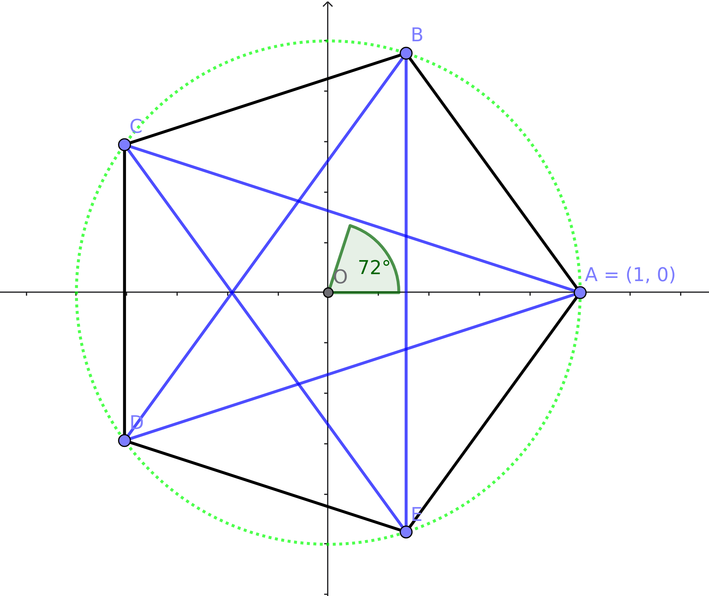

# Symmetric Groups and Permutations

## 1. Introduction

### 1.1 Symmetries of the Pentagon

In order to demonstrate basic features of the *utilities.permutation* module, we will be working with a type of symmetry group known as a dihedral group.  In our case, we will be working with the symmetries of a regular pentagon, or equivalently, the symmetries of a regular pentagram.  This symmetry group is known variously as D₅ (because a pentagon has five vertices) or as D₁₀ (because the group contains ten symmetries.  Here we will call the group D₅.

<center>
<br>
<b>Figure 1.</b> The regular pentagon.
</center>

In Figure 1, we have a pentagon (black) inscribed in a unit circle (green), and also a pentagram (blue) using the same vertices.  The vertices are labelled A, B, C, D and E.  The permissible symmetries are length-preserving continuous maps of the plane which map the pentagon (or equivalently the pentagram) to itself.  The possibilities are combinations of translations, rotations, or reflections.  Translations can be discarded as they move the center to somewhere else.  Rotations must be in multiples of 72°.  These move the five vertices around the circle, preserving their order:
```
          0°        ABCDE ⊢ ABCDE       (identity)
         72°        ABCDE ⊢ BCDEA       (counterclockwise 72°)
        144°        ABCDE ⊢ CDEAB
        216°        ABCDE ⊢ DEABC
        288°        ABCDE ⊢ EABCD       (clockwise 72°)
```
In addition, we have five reflections.  Notice that we cannot reflect through the *y*-axis as this misplaces the vertices.  Reflection through the origin is nicer, but it still misplaces the vertices.  We can, however reflect this particular image through the *x*-axis.  If we rotate the axes through a multiple of 72°, we obtain four more reflections.  For now, we note that our basic reflection is:
```
        τ           ABCDE ⊢ AEDCB       reflection through *x*-axis
```
Note that vertex A is fixed, *i.e.* τ(A)=A while the remaining vertices all move to new positions.

### 1.2 The Files

* module: *utilities.permutation*
* this document: *doc/permutations.md*
* demonstration module: *demos.permutations*
* the pentagon illustration: *doc/pentagon.png*

The demonstration module can be run in python:
```
    $ python -m demos.permutation
```
or it can be opened as a file (*demos/permutation.py*) and run in Python's *idle* interpreter.  We will discuss this code in subsequent sections.

The pentagon illustration was created using Geogebra.

## 2. Getting started

The first statement in the demo imports a class called *SymmetricGroup*:
```python
        from utilities.permutation import SymmetricGroup
```
Let's look at the help:
```
class SymmetricGroup(builtins.object)
   SymmetricGroup(alphabet:str='ABCDE...WXYZ', name:str=None)

   define a permutation group

   Methods defined here:

   __getitem__(self, index) -> dict
       returns letter #i in the alphabet

   __init__(self, alphabet:str='ABCDE...WXYZ', name:str=None)
       constructor

   apply(self, f:Permutation, s: str)
       apply a permutation to a string

   cycle(self, *args) -> Permutation
       create a cyclic permutation

   fetch(self, key, delete=False) -> (Permutation, NoneType)
       returns a stored permutation

       If delete is true, the key is removed.

   shift(self, h: int = 1) -> Permutation
       return a rotation

   store(self, key:'hashable', s:Permutation)
       stores a permutation

   swap(self, a: str, b: str) -> Permutation
       return the permutation which interchanges a and b

   to_index(self, letter: str) -> (int, NoneType)
       returns the index of a letter, or None if the letter isn't there'

   ----------------------------------------------------------------------
   Readonly properties defined here:

   alphabet
       returns the alphabet as a (frozen) set

   identity
       return the identity permutation

   n
       the length of the alphabet

   name
       returns the name of the group
```

The definitions refer to another class *Permutation* which is also defined in *utilities.permutations*.  We use the group itself to create members of the class, so we don't need to import class *Permutation*.

The dihedral group D₅ is a subgroup of the symmetric group S₅.  S₅ has 120 distinct symmetries, but we only need ten of these.  Since our vertices are labelled "A" through "E", we should use the letters "A" through "E" as our alphabet.

The default alphabet is the string of capital letters used in English, usually called the Latin alphabet.  (That's a misnomer as (i) Latin had no "w", (i) "u" and "v" were the same letter in Latin, and (iii) "i" and "j" were likewise one and the same.)  We only need the first five.  Our group is D₅.  (If we don't attach a name, the program assumes we are dealing with complete symmetric group on our alphabet and a name is assigned accordingly.)  We want to assign both an alhabet (the vertex labels) and a name:
```python
        ALPHABET = "ABCDE"
        D5 = SymmetricGroup(alphabet=ALPHABET, name="D₅")
```

## 3. Adding permutations

### 3.1 The identity permutation

Permutations are typically named using Greek letters, and iota is a common name for the identity permutation:
```python
            # Define the identity
        I = D5.identity
        D5.store('ι', I)
```
We gave it the name *I* for Python and filed it under the name iota ("ι") for future reference.  Let's test it.  First, its type is *Permutation*.  Next, if we apply it to the alphabet, we simply get the alphabet string in the same order.
```
    >>> type(I)
    <class 'utilities.permutation.Permutation'>
    >>> I.apply(ALPHABET)
    'ABCDE'
```
We include the following code to display the test inside the demonstration:
```python
        print(f"ι('{ALPHABET}') = '{I.apply(ALPHABET)}'")
```
In response, the demo module displays:
```
    ι('ABCDE') = 'ABCDE'
```

(The *Permutation.apply* method actually calls the *SymmetricGroup.apply* method.)  Input to *Permutation.apply* is a string.  For example:
```
    >>> I.apply("xABCDExEDCBAx")
    'xABCDExEDCBAx'
```
Characters that aren't in the alphabet are simply copied.  Those in the alphabet are moved accordingly.  Since the identity permutation moves nothing, the string here is just copied -- but this isn't a particular effcient way of copying a string.

### 3.2 Rotations

Rotations are typically named rho ("ρ").  There are five rotations in D₅ and all five can be produced as powers of either a 72-degree counterclockwise or a 72-degree clockwise rotation.  The usual convention is counterclockwise (British Received: anticlockwise).

To rotate the pentagon in Figure 1 counterclockwise, we rotate vertices A, B, C, D, and E respectively to B, C, D, E, and A.  From the standpoint of our alphabet as a string, this is a circular shift of one place:
```python
            # Define the basic rotation
        R = D5.shift(1)
        D5.store('ρ', R)
        print(f"ρ('{ALPHABET}') = '{R.apply(ALPHABET)}'")
```
The demo module prints the following:
```
    ρ('ABCDE') = 'BCDEA'
```
To see how this works with an arbitrary string:
```
    R.apply('xABCDExEDCBAx')
    'xBCDEAxAEDCBx'
```
The lower case x occurrences are copied verbatim, but the five letters of our vertex alphabet are moved accordingly.  We don't actually need the variable R -- we can use the name 'ρ' to access the permutation using the *fetch* method:
```
    D5.fetch('ρ').apply('xABCDExEDCBAx')
    'xBCDEAxAEDCBx'
```

There are three more rotations.  We can obtain them using the *shift* method or as powers of the permutation ρ.  We'll do it the first way:
```python
            # Define the remaining rotations
        elems = ['ι', 'ρ']
        superscripts = "⁰¹²³⁴"
        for n in range(2, 5):
            name = f"ρ{superscripts[n]}"
            elems.append(name)
            D5.store(name, D5.shift(n))
            print(f"{name}('{ALPHABET}') \
                = '{D5.fetch(name).apply(ALPHABET)}'")
```
The print statement yields the following lines:
```
    ρ²('ABCDE') = 'CDEAB'
    ρ³('ABCDE') = 'DEABC'
    ρ⁴('ABCDE') = 'EABCD'
```
And to verify everything works as expected, we check against powers of our basic rotation 'ρ' which still is named *R* in our Python script:
```
    >>> R ** 0 == I
    True
    >>> R ** 1 == R
    True
    >>> R ** 2 == D5.fetch('ρ²')
    True
    >>> R ** 3 == D5.fetch('ρ³')
    True
    >>> R ** 4 == D5.fetch('ρ⁴')
    True
```
Rotating the pentagon 5 times through our basic angle of 72° has the same effect of not rotating at all:
```
    >>> R ** 5 == I
    True
```
Rotating clockwise 72° and then rotating counterclockwise 72° also has the same effect as doing nothing:
```
    >>> R * (R**4) == I
    True
    >>> R.inverse == R ** 4
    True
    >>> D5.fetch('ρ') * D5.fetch('ρ⁴') == I
    True
```
Our three basic operations have all come up in our Python examples:

*  composition -- we're using Python's multiplication operator -- if we have two permutations μ and ν, their composition is the permutation μ`*`ν has the same effect on any string *s* as μ(ν(*s*)), *i.e.*, first *applying* ν and then applying μ;
*  inverse - the inverse of a permutation μ is the unique permutation ν for which μ`*`ν and ν`*`μ are equal to the identity ι;
*  powers - just as powers of numbers are repeated multiplications, powers of permutations are repeated compositions -- for example μ`*`μ`*`μ is the same as μ³.

A group is a quadruple G=(X,`*`,ι,⁻¹) consisting of a set X, binary operator `*` on X, a constant ι which is a member of X, and a unary operator ⁻¹ such that:

*  (μ`*`ν`)*`σ=μ`*`(ν`*`σ) for all μ, ν and σ in X;
*  ι`*`μ=μ=μ`*`ι for all μ in X; and
*  μ⁻¹`*`μ=ι=μ`*`μ⁻¹ for all μ in X.

In other words, composition is associative and has an identity element, and each element has an inverse.  Groups are not necessarily commutative.  Cayley's Theorem says that every group can be realized as a group of permutations.  (Arthur Cayley was prolific -- there are several theorems which take his name.)

At this point, we've defined the five rotations:
```
    elems
    ['ι', 'ρ', 'ρ²', 'ρ³', 'ρ⁴']
```

These five permutations form a group which is structurally equivalent to the group integers modulo 5 under addition.  But the dihedral group has also has five reflections.

### 3.3 Reflections

If we draw a line segment from a vertex of the pentagon to the midpoint of the opposite side, the pentagon is symmetric with respect to this line segment (or axis of symmetry.  In Figure 1, one such segment runs along the *x*-axis.  A reflection through this axis fixes point A, and swaps B and C respectively with E and D.

We can represent this permutation using cycle notation.  Since A is fixed, we can treat it as a 1-cycle (A), or better yet, ignore it.  We have two swaps or 2-cycles (B,E) and (C,D).  *Disjoint* 2-cycles commute -- we can compose them in either order (B,E)`*`(C,D) or (C,D)`*`(B,E).  The greek letter tau 'τ' is conventionally used for reflections.  So we'll call this reflection τ₀.  The reflection that fixes B will be τ₁, and so on counterclockwise around the pentagon.

Proceeding along these lines:
```python
            # Define the basic reflection...
        T = D5.swap('B', 'E') * D5.swap('C', 'D')
        D5.store('τ₀', T)
        elems.append('τ₀')
        print(f"τ₀('{ALPHABET}') = '{T.apply(ALPHABET)}'")
```
We have our first reflection:
```
    τ₀('ABCDE') = 'AEDCB'
```

To see how to proceed to define the remaining reflection, let's compose it with each of the rotations.  At this point, unless we are already familiar with D₅, we don't know whether the group is commutative, so we should compose each rotation with the basic reflection *and* compose the basic reflection with each reflection...  Of course we don't need to include the identity.
```python
            # Compose τ₀ with the nontrivial rotations
        nu = elems[-1]
        g = D5.fetch(nu)
        assert g == T
        for n in range(1,5):
            mu = elems[n]
            f = D5.fetch(mu)
            print(f"({mu}*{nu})('{ALPHABET}') \
                = '{(f*g).apply(ALPHABET)}'")
            print(f"({nu}*{mu})('{ALPHABET}') \
                = '{(g*f).apply(ALPHABET)}'")
```
The response:
```
    (ρ*τ₀)('ABCDE') = 'BAEDC'
    (τ₀*ρ)('ABCDE') = 'EDCBA'
    (ρ²*τ₀)('ABCDE') = 'CBAED'
    (τ₀*ρ²)('ABCDE') = 'DCBAE'
    (ρ³*τ₀)('ABCDE') = 'DCBAE'
    (τ₀*ρ³)('ABCDE') = 'CBAED'
    (ρ⁴*τ₀)('ABCDE') = 'EDCBA'
    (τ₀*ρ⁴)('ABCDE') = 'BAEDC'
```
Evidently D₅ is noncommutative!  We can look at what's fixed in each case:
```
                  Fixed Points for τ₀ after rotation
            ---------------------------------------------
            reflection * rotation   rotation * reflection
    ρ               D                       C
    ρ²              B                       E
    ρ³              E                       B
    ρ⁴              C                       D
```
To move the reflection one place clockwise we need to compose on the left by ρ² or, equivalently, on the right by ρ³.  With that information we can now code the remaining reflections:
```python
            # fill in the remaining four reflections
        subscripts = "₀₁₂₃₄"
        f = D5.fetch("ρ²")
        for n in range(1, 5):
            g = (f**n)*T
            name = f"τ{subscripts[n]}"
            permuted = g.apply(ALPHABET)
            print(f"{name}('{ALPHABET}') = '{permuted}'")
            assert permuted[n] == ALPHABET[n]
            D5.store(name, g)
            elems.append(name)
        print(elems)
        print(f"order of {D5.name}: {len(elems)}")
```
It's easy to get things twisted: the assertion insures that we got it right.

The displays:
```
    τ₁('ABCDE') = 'CBAED'
    τ₂('ABCDE') = 'EDCBA'
    τ₃('ABCDE') = 'BAEDC'
    τ₄('ABCDE') = 'DCBAE'
    ['ι', 'ρ', 'ρ²', 'ρ³', 'ρ⁴', 'τ₀', 'τ₁', 'τ₂', 'τ₃', 'τ₄']
    order of D₅: 10
```

Reflections are self inverting.  If we square a reflection, we get the identity.  If we just consider a single reflection τ along with the identity element, we a obtain a group which isomorphic to (*i.e.* structurally equivalent to) addition modulo 2.  (The identity corresponds with the even integers while reflection corresponds with the odd integers.  Here is the code to verify these facts:
```
            # observe that the reflections are their own inverses!
        for n in range(5, 10):
            name = elems[n]
            f = D5.fetch(name)
            print(f"{name}⁻¹ = {name};     {name}² = ι")
            g = f.inverse
            h = f ** 2
            assert f == g
            assert h == I
```

And here is the output:
```
    τ₀⁻¹ = τ₀;     τ₀² = ι
    τ₁⁻¹ = τ₁;     τ₁² = ι
    τ₂⁻¹ = τ₂;     τ₂² = ι
    τ₃⁻¹ = τ₃;     τ₃² = ι
    τ₄⁻¹ = τ₄;     τ₄² = ι
```

## 4. Summarizing

### 4.1 Tables for D₅

Let's prepare a table of inverses and a table of compositions for D₅.  We'll throw in some block drawing characters to make them look pretty.  Here is the code with just a few comments:
```python
            # prepare tables for the dihedral group D₅
        print(f"Tables for {D5.name}")
```

Obviously we'd like to see the name of the group.  Next comes the table of inverses.  We display the name of the permutation above the line and the name of its inverse below the line.  To get the name of the inverse, we need to search through the names to find a match.  We can short-circuit this for the identity and the reflections, but we do want to catch errors.  So we catch these using the condition:
```
    >>> if f == g:
    >>>     ...
```

The code for the inverses:
```python
        print()
        print("Inverses:")
        print(" μ   ║", end="")
        for n in range(10):
            print(f" {elems[n]:2}", end="")
        print()
        print("═════╬" + "═"*31)
        print(" μ⁻¹ ║", end="")
        for n in range(10):
            f = D5.fetch(elems[n])
            g = f.inverse
            if f == g:              # identity or reflection
                print(f" {elems[n]:2}", end="")
            else:                   # non-trivial rotation
                inverse = "ERROR"
                for m in range(1, 5):
                    name = elems[m]
                    if D5.fetch(name) == g:
                        inverse = name
                        break
                print(f" {inverse:2}", end="")
        print()
```
The "ERROR" string is there to catch something that doesn't map to an element of D₅.  Also note that we only searched the non-trivial rotations for their inverses.  Caution is wise, but we did not need to worry as the results were as expected:
```
    Inverses:
         μ   ║ ι  ρ  ρ² ρ³ ρ⁴ τ₀ τ₁ τ₂ τ₃ τ₄
        ═════╬═══════════════════════════════
         μ⁻¹ ║ ι  ρ⁴ ρ³ ρ² ρ  τ₀ τ₁ τ₂ τ₃ τ₄
```

We do essentially the same thing for the compositions.  The main differences are that we probably won't gain much by short-circuiting the search process for the result, and instead of a one-dimension vector of results, our results form a two-dimensional matrix.  Here is the code:
```python
print()
print("Compositions:")
print("   μ*ν ║", end="")
for nu in elems:
    print(f" {nu:2}", end="")
print(" = ν")
print("═══════╬" + "═"*31)
first, other = "μ = ", "    "
for mu in elems:
    print(first, end="")
    first = other
    print(f"{mu:2} ║", end="")
    f = D5.fetch(mu)
    for nu in elems:
        g = D5.fetch(nu)
        h = f*g
        prod = "ERROR"
        for name in elems:
            if D5.fetch(name) == h:
                prod = name
                break
        print(f" {prod:2}", end="")
    print()
```
And here are our tables:
```
            Tables for D₅

    Inverses:
     μ   ║ ι  ρ  ρ² ρ³ ρ⁴ τ₀ τ₁ τ₂ τ₃ τ₄
    ═════╬═══════════════════════════════
     μ⁻¹ ║ ι  ρ⁴ ρ³ ρ² ρ  τ₀ τ₁ τ₂ τ₃ τ₄

    Compositions:
       μ*ν ║ ι  ρ  ρ² ρ³ ρ⁴ τ₀ τ₁ τ₂ τ₃ τ₄ = ν
    ═══════╬═══════════════════════════════
    μ = ι  ║ ι  ρ  ρ² ρ³ ρ⁴ τ₀ τ₁ τ₂ τ₃ τ₄
        ρ  ║ ρ  ρ² ρ³ ρ⁴ ι  τ₃ τ₄ τ₀ τ₁ τ₂
        ρ² ║ ρ² ρ³ ρ⁴ ι  ρ  τ₁ τ₂ τ₃ τ₄ τ₀
        ρ³ ║ ρ³ ρ⁴ ι  ρ  ρ² τ₄ τ₀ τ₁ τ₂ τ₃
        ρ⁴ ║ ρ⁴ ι  ρ  ρ² ρ³ τ₂ τ₃ τ₄ τ₀ τ₁
        τ₀ ║ τ₀ τ₂ τ₄ τ₁ τ₃ ι  ρ³ ρ  ρ⁴ ρ²
        τ₁ ║ τ₁ τ₃ τ₀ τ₂ τ₄ ρ² ι  ρ³ ρ  ρ⁴
        τ₂ ║ τ₂ τ₄ τ₁ τ₃ τ₀ ρ⁴ ρ² ι  ρ³ ρ
        τ₃ ║ τ₃ τ₀ τ₂ τ₄ τ₁ ρ  ρ⁴ ρ² ι  ρ³
        τ₄ ║ τ₄ τ₁ τ₃ τ₀ τ₂ ρ³ ρ  ρ⁴ ρ² ι
```
Note that if we divide our 10×10 composition matrix into four 5×5 blocks, the blocks in the upper left are products of rotations and the entries are all rotations.

The 5×5 block in the lower right consists of composition products of reflections -- all these products are rotations. The diagonal entries (from upper left to lower right) in this block are all ι -- a reflection is its own inverse.

The two remaining blocks, on in the lower left, the other in the upper right are products of a rotation and a reflection.

The block in the upper left is symmetric about the main diagonal.  This is because compositions of rotations are commutative.  The rest of the entries don't display symmetry about the main diagonal.

One more observation: note that each row and each column in the composition matrix contains exactly one copy of each permutation.

### Associativity

One property that is hard to verify using a matrix of this sort is associativity,  So we should check associativity programmatically:
```python
                # Associativity
        for mu in elems:
            f = D5.fetch(mu)
            for nu in elems:
                g = D5.fetch(nu)
                for sigma in elems:
                    h = D5.fetch(sigma)
                    if f*(g*h) != (f*g)*h:
                        print(f"{mu=} {nu=} {sigma=}  not associative")
```
If we have a problem, then the location will be displayed.  If not, then we have the sound of silence.  And the silence is golden.